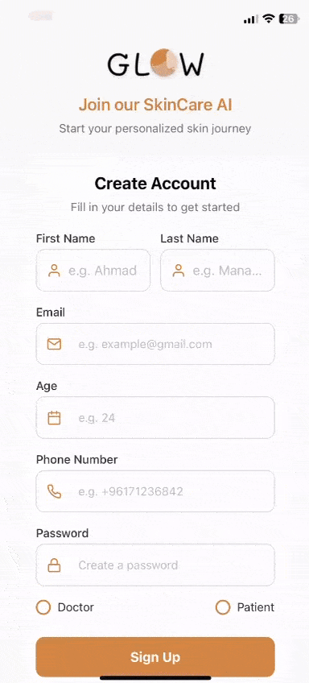
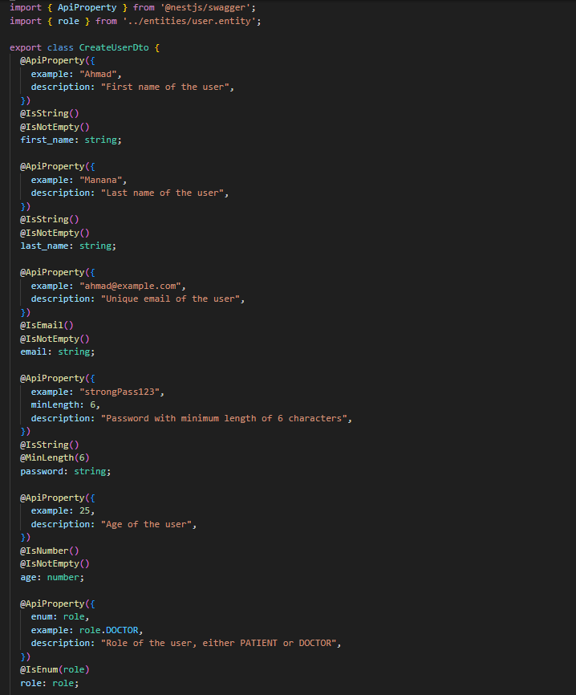
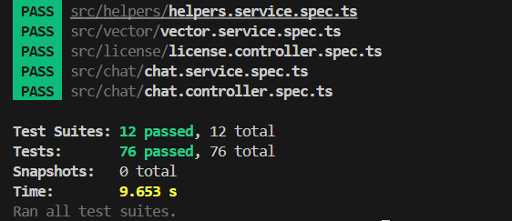

  

<!-- project overview -->

> Glow is an AI-powered skincare mobile application designed to help users understand, improve, and care for their skin with ease. By analyzing selfies, Glow detects common skin concerns such as acne, dryness, pigmentation, and redness, then generates personalized skincare plans and tailored product recommendations based on each user's unique skin profile.
> 
> To make skincare guidance more accessible, Glow integrates with WhatsApp, where users can interact with an AI assistant for instant support. This assistant can answer questions about their analysis, suggest products, provide skincare tips, and help address any skin-related concerns in real-time.
> 
> Glow also tracks progress over time, helping users stay consistent and see measurable improvements. With its combination of advanced AI technology and smart reminders. Glow makes personalized skincare guidance simple, professional, and always within reach.

  

<!-- System Design -->

### Entity Relation Diagram

  

### System Architecture

  

<!-- Project Highlights -->

### Sexy features

- Smart AI skincare assistant
- Seamless WhatsApp integration
- Dynamic automation with n8n

  
  

<!-- Demo -->

### User Screens (Mobile)

| Login screen                            | Register screen                       | Home screen screen                       |
| --------------------------------------- | ------------------------------------- | ------------------------------------- |
|  |  |  |

| Analysis screen                            | Doctors screen                       | Overview screen screen                       |
| --------------------------------------- | ------------------------------------- | ------------------------------------- |
|  |  |  |

| History screen                            | Profile screen                       | Home screen after analysis                        |
| --------------------------------------- | ------------------------------------- | ------------------------------------- |
|  |  |  |

| Overview screen after analysis                            | History screen after analysis                      |                        |
| --------------------------------------- | ------------------------------------- | ------------------------------------- |
|  |  |  |

| AI Analysis                           | AI Analysis part 2                       | AI Agent integrated in Whatsapp                       |
| --------------------------------------- | ------------------------------------- | ------------------------------------- |
|  |  |  |

| AI Agent Integrated in Whatsapp                            | AI Agent Integrated in Whatsapp                       | Doctor Validation automated using n8n                        |
| --------------------------------------- | ------------------------------------- | ------------------------------------- |
|  |  |  |

| Doctor Validation automated using n8n                            |Doctor Validation automated using n8n                      |Doctor Validation automated using n8n                        |
| --------------------------------------- | ------------------------------------- | ------------------------------------- |
|  |  |  |

  

<!-- Development & Testing -->

### Linear Board

- Created a new ticket in Linear to track the feature or bug fix, clearly defining its scope and requirements.
- Created a dedicated Git branch named after the ticket to keep changes isolated and organized.
- Committed code regularly with descriptive messages referencing the ticket for clear traceability.
- Pushed changes to the remote repository to share progress with the team.
- Opened a Pull Request (PR) for code review, ensuring quality and collaboration.
- Linked the PR to the Linear ticket, automatically updating its status during the workflow.
- Merged the PR, which moved the ticket to “Done” in Linear, completing the development cycle.

### Services, Validation and Testing Samples

| Services                            | Validation                       | Testing                        |
| --------------------------------------- | ------------------------------------- | ------------------------------------- |
|  |  |  |

### Swagger APIs

### Swagger Signup API

  

<!-- Deployment -->

### Development → Deployment Flow

- The development process begins by creating a local branch for each new feature. This allows developers to work on features in isolation without affecting the main codebase. Once progress is made, the branch is pushed to its corresponding remote branch on GitHub, ensuring proper version control and collaboration with the team.

- When the feature is ready for integration, the remote branch is merged into the staging branch. This action automatically triggers GitHub Actions workflows, initiating the continuous integration (CI) process to validate the changes before deployment.

- During the CI process, GitHub Actions provisions a temporary PostgreSQL database specifically for testing purposes. It then runs Prisma migrations, executes automated tests, and boots the NestJS backend in a test environment. If all tests and checks pass successfully, the pipeline moves forward to the deployment stage.

- Next, GitHub Actions deploys the latest code to the staging EC2 instance. A deployment script is executed to build Docker containers for the NestJS backend, React Native frontend, and PostgreSQL database. These containers are then launched to serve the staging environment, allowing the team to test and review the new features in a production-like setting.

- Finally, once the feature is fully tested and approved, the staging branch is merged into the main branch. This triggers GitHub Actions to rerun the same pipeline steps, but this time the deployment targets the production EC2 instance, making the new feature live for end users.

  
