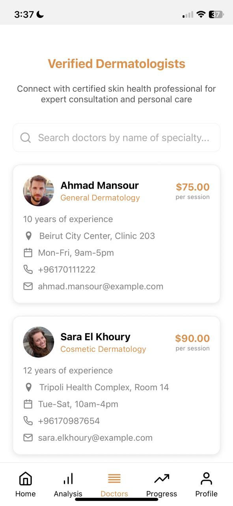

  

<!-- project overview -->

> Glow is an AI-powered skincare mobile application designed to help users understand, improve, and care for their skin with ease. By analyzing selfies, Glow detects common skin concerns such as acne, dryness, pigmentation, and redness, then generates personalized skincare plans and tailored product recommendations based on each user's unique skin profile.
> 
> To make skincare guidance more accessible, Glow integrates with WhatsApp, where users can interact with an AI assistant for instant support. This assistant can answer questions about their analysis, suggest products, provide skincare tips, and help address any skin-related concerns in real-time.
> 
> Glow also tracks progress over time, helping users stay consistent and see measurable improvements. With its combination of advanced AI technology and smart reminders. Glow makes personalized skincare guidance simple, professional, and always within reach.

  

<!-- System Design -->

### Entity Relation Diagram

  

### System Architecture

  

<!-- Project Highlights -->

### Sexy features

- Smart AI skincare assistant: An advanced AI agent provides personalized recommendations, answers your questions, and offers guidance on overall skin health and concerns.
- Seamless WhatsApp integration: Users can chat directly with the AI through WhatsApp to get instant skincare advice, routine reminders, and progress updates.
- Dynamic automation with n8n: Automated workflows that validate and verify doctors.
  
  

<!-- Demo -->

### User Screens (Mobile)

| Login screen                            | Register screen                       | Home screen screen                       |
| --------------------------------------- | ------------------------------------- | ------------------------------------- |
|  |  |  |

| Analysis screen                            | Doctors screen                       | Overview screen screen                       |
| --------------------------------------- | ------------------------------------- | ------------------------------------- |
|  |  |  |

| History screen                            | Profile screen                       | Home screen after analysis                        |
| --------------------------------------- | ------------------------------------- | ------------------------------------- |
|  |  |  |

| Overview screen after analysis                            | History screen after analysis                      |                        |
| --------------------------------------- | ------------------------------------- | ------------------------------------- |
|  |  |  |

| AI Analysis                           | AI Analysis part 2                       | AI Agent integrated in Whatsapp                       |
| --------------------------------------- | ------------------------------------- | ------------------------------------- |
|  |  |  |

| AI Agent Integrated in Whatsapp                            | AI Agent Integrated in Whatsapp                       | Doctor Validation automated using n8n                        |
| --------------------------------------- | ------------------------------------- | ------------------------------------- |
|  |  |  |

| Doctor Validation automated using n8n                            |Doctor Validation automated using n8n                      |Doctor Validation automated using n8n                        |
| --------------------------------------- | ------------------------------------- | ------------------------------------- |
|  |  |  |

  

<!-- Development & Testing -->

### Add Title Here

| Services                            | Validation                       | Testing                        |
| --------------------------------------- | ------------------------------------- | ------------------------------------- |
|  |  |  |

  

<!-- Deployment -->

### Add Title Here

- Description here.

| Postman API 1                            | Postman API 2                       | Postman API 3                        |
| --------------------------------------- | ------------------------------------- | ------------------------------------- |
|  |  |  |

  
